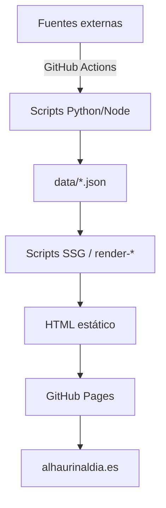

# Manual de Administración — Alhaurín al Día

> Versión: 1.0 · Agosto 2026
> Repositorio: [github.com/jburez/alhaurin-al-dia](https://github.com/jburez/alhaurin-al-dia)
> Web: [alhaurinaldia.es](https://alhaurinaldia.es)

---

## 1. Arquitectura General

Alhaurín al Día es un sitio **estático** (HTML/CSS/JS) desplegado en **GitHub Pages** con **automatizaciones vía GitHub Actions** que actualizan los datos periódicamente.



| Capa | Tecnología | Descripción |
|------|-----------|-------------|
| Hosting | GitHub Pages | Branch `main` → producción |
| Automatización | GitHub Actions | 5 workflows programados |
| Datos | JSON estáticos | 18 archivos en `data/` |
| Render | Node.js + Python | Scripts de generación estática |
| Frontend | Vanilla HTML/CSS/JS | Sin frameworks, máxima velocidad |

---

## 2. Ramas Git

| Rama | Propósito | Protegida |
|------|----------|-----------|
| `develop` | Rama de trabajo principal. Todos los cambios van aquí primero | No |
| `main` | Producción. Se publica automáticamente en GitHub Pages | Sí (merge desde develop) |
| `seo/sprint-*` | Ramas históricas de sprints SEO (archivadas) | No |

### Flujo de despliegue

```
develop → push → main (merge --no-edit) → push → GitHub Pages despliega
```

**Comando para publicar cambios:**
```bash
cd ~/Documents/alhaurin-al-dia
git add .
git commit -m "Descripción del cambio"
git push origin develop
git checkout main && git merge develop --no-edit && git push origin main && git checkout develop
```

---

## 3. Estructura de Directorios

```
alhaurin-al-dia/
├── index.html              ← Home page
├── 404.html                ← Página de error
├── _redirects              ← Redirects (si aplica)
├── _headers                ← Headers de seguridad
├── robots.txt              ← Directivas para bots
├── sitemap*.xml            ← Sitemaps (6 archivos)
├── feed-news.xml           ← RSS de noticias
│
├── css/                    ← 18 archivos CSS
│   ├── styles.css          ← Hoja base (design tokens, layout)
│   ├── mobile.css          ← Responsive / mobile
│   ├── home-*.css          ← Widgets de la home
│   └── ...
│
├── js/                     ← 6 archivos JS (frontend)
│   ├── app.js              ← JS global (menú, navegación)
│   ├── home-agenda.js      ← Widget agenda en home
│   ├── home-guardia.js     ← Widget farmacia de guardia
│   ├── home-live.js        ← Widget estado en tiempo real
│   └── ...
│
├── data/                   ← 18 archivos JSON de datos
│   ├── noticias.json       ← Noticias recientes (70KB)
│   ├── noticias-archivo.json ← Archivo completo (496KB)
│   ├── agenda-local.json   ← 268 eventos (175KB)
│   ├── evento-slugs.json   ← Mapa ID→slug de eventos
│   ├── avisos-locales.json ← Avisos activos + historial
│   ├── avisos-oficiales.json ← Avisos de AEMET
│   ├── boletin-oficial.json ← BOP de Málaga
│   ├── tiempo-aemet.json   ← Previsión meteorológica
│   ├── estado-local.json   ← Estado en tiempo real
│   └── ...
│
├── scripts/                ← 40 scripts de automatización
│   ├── lib/                ← Librerías compartidas (footer, etc.)
│   └── ...
│
├── .github/workflows/      ← 8 workflows de GitHub Actions
│
├── noticias/               ← 591 páginas de noticias
├── planes/                 ← Calendario + 268 páginas de eventos
├── guia-util/              ← 30 páginas de la guía
├── categoria/              ← 12 páginas de categorías
├── tiempo/                 ← 5 páginas de meteorología
├── avisos/                 ← Página de avisos
├── boletin-oficial/        ← BOP
├── radar-social/           ← Radar Social (reportes vecinales)
├── seguimiento/            ← Seguimiento de proyectos
├── comercios/              ← Directorio de comercios
├── anunciarse/             ← Página comercial
├── contacto/               ← Contacto
├── sobre-nosotros/         ← Sobre nosotros
├── mi-alhaurin/            ← Panel admin (oculto)
└── virgen-de-gracia-2026/  ← Programa fiestas patronales
```

**Total**: 1.050 archivos rastreados · 327 páginas HTML

---

## 4. Automatizaciones (GitHub Actions)

### Workflows programados

| Workflow | Archivo | Frecuencia | Qué hace |
|----------|---------|-----------|----------|
| **Noticias** | `generar-noticias.yml` | Cada 2 horas | Scrapea RSS de fuentes locales, genera `noticias.json` y páginas HTML |
| **Agenda** | `actualizar-agenda-ayto.yml` | Cada 6 horas | Importa eventos del Ayuntamiento + alhaurinhoy.es, genera páginas de eventos |
| **Meteorología** | `actualizar-avisos-aemet.yml` | Cada hora | Actualiza avisos de AEMET |
| **BOP** | `actualizar-boletin-oficial.yml` | A las 7:00 | Scrapea el Boletín Oficial Provincial |
| **Estado local** | `update-local-status.yml` | 6:15, 10:15, 15:15 | Actualiza estado en tiempo real |

### Workflows manuales

| Workflow | Archivo | Cuándo usarlo |
|----------|---------|--------------|
| **Publicar producción** | `publicar-produccion.yml` | Merge de develop → main |
| **Code review** | `claude-code-review.yml` | Revisión automática de PRs |

### Ejecutar un workflow manualmente

Desde GitHub → Actions → seleccionar workflow → "Run workflow"

O desde terminal:
```bash
gh workflow run generar-noticias.yml --ref develop
```

---

## 5. Fuentes de Datos

### Noticias (cada 2h)

| Fuente | Tipo | Script |
|--------|------|--------|
| RT Alhaurín el Grande | RSS | `generar_noticias.py` |
| Ayuntamiento | RSS | `generar_noticias.py` |
| Diputación de Málaga | RSS | `generar_noticias.py` |
| Revista Lugar de Encuentro | RSS (filtrado: solo Alhaurín) | `generar_noticias.py` |

### Agenda (cada 6h)

| Fuente | API | Script |
|--------|-----|--------|
| alhaurinhoy.es | WP REST API (`/wp-json/wp/v2/ajde_events`) | `actualizar_agenda_alhaurinhoy.py` |
| Ayuntamiento | Sede electrónica | `actualizar_agenda_ayto.py` |
| Manuales | Editados directamente en `agenda-local.json` | — |

### Otras fuentes

| Fuente | Frecuencia | Script |
|--------|-----------|--------|
| AEMET (avisos meteo) | Cada hora | `actualizar_avisos_aemet.py` |
| AEMET (previsión) | Manual | `actualizar_tiempo_aemet.py` |
| BOP de Málaga | Diario a las 7:00 | `actualizar_bop_malaga.py` |
| Sede electrónica Ayto | Manual | `actualizar_sede_electronica.py` |

---

## 6. Tareas de Mantenimiento

### 📰 Publicar una noticia manualmente

1. Añadir al JSON `data/noticias.json`:
```json
{
  "id": "mi-noticia-2026",
  "titulo": "Título de la noticia",
  "resumen": "Resumen breve...",
  "contenido": "Contenido HTML completo...",
  "fecha": "2026-08-17T10:00:00+02:00",
  "categoria": "actualidad",
  "fuente": "Alhaurín al Día",
  "url": "/noticias/mi-noticia-2026.html"
}
```
2. Crear la página HTML: `noticias/mi-noticia-2026.html`
3. Ejecutar `node scripts/render-home-widgets-static.js` para actualizar la home
4. Commit y push

### 📅 Añadir un evento manual

1. Editar `data/agenda-local.json`, añadir al array `eventos`:
```json
{
  "id": "mi-evento-unico",
  "tipo": "Fiestas",
  "icono": "🎉",
  "titulo": "Nombre del evento",
  "descripcion": "Descripción detallada del evento...",
  "lugar": "Plaza Baja",
  "inicio": "2026-09-15T20:00:00+02:00",
  "fin": "2026-09-15T23:00:00+02:00",
  "estado": "neutral",
  "cta": "Ver más",
  "url": "#",
  "activo": true,
  "fuente": "manual"
}
```
2. Regenerar páginas y home:
```bash
python3 scripts/generar_paginas_eventos.py
node scripts/render-home-widgets-static.js
```
3. Commit y push

### ⚠️ Publicar un aviso urgente

1. Editar `data/avisos-locales.json`:
```json
{
  "avisos": [
    {
      "tipo": "Agua",
      "icono": "💧",
      "titulo": "Corte de agua en Calle X",
      "detalle": "Afecta a las calles X, Y, Z de 8:00 a 14:00h.",
      "estado": "urgent",
      "fuente": "Ayuntamiento",
      "inicio": "2026-08-17T08:00:00+02:00",
      "fin": "2026-08-17T14:00:00+02:00",
      "activo": true
    }
  ]
}
```
2. Cuando se resuelva, mover al array `historial` con `"resuelto": true`

### 🏪 Actualizar comercio destacado

Editar `data/comercios-destacados.json` y añadir/modificar la ficha.

### 💊 Actualizar farmacias de guardia

Ejecutar:
```bash
python3 scripts/extraer_calendario_farmacias.py
node scripts/render-farmacia-guardia-static.js
```

### 🌤️ Actualizar previsión del tiempo

```bash
python3 scripts/actualizar_tiempo_aemet.py
node scripts/render-tiempo-static.js
```

---

## 7. Scripts — Referencia Rápida

### Scripts de datos (Python)

| Script | Descripción |
|--------|-------------|
| `actualizar_agenda_alhaurinhoy.py` | Importa 1429 eventos de alhaurinhoy.es (paginado), dedup inteligente |
| `actualizar_agenda_ayto.py` | Importa eventos de la sede electrónica del Ayuntamiento |
| `actualizar_avisos_aemet.py` | Descarga avisos meteorológicos de AEMET |
| `actualizar_bop_malaga.py` | Scrapea el BOP Provincial (edictos de Alhaurín) |
| `actualizar_sede_electronica.py` | Extrae datos de la sede electrónica municipal |
| `actualizar_tiempo_aemet.py` | Previsión horaria/diaria/agrícola desde AEMET |
| `extraer_calendario_farmacias.py` | Extrae calendario de guardias de farmacias |
| `generar_guia.py` | Genera páginas de la guía útil desde JSON |
| `generar_noticias.py` | Scrapea RSS y genera noticias (41KB, el más complejo) |
| `generar_noticias_seguro.py` | Versión segura de generar_noticias (con validación) |
| `generar_paginas_eventos.py` | Genera 268 páginas estáticas para eventos |
| `generar_sitemap.py` | Genera los sitemaps XML |
| `validar_contenido.py` | Valida la integridad del contenido |

### Scripts de renderizado (Node.js)

| Script | Descripción |
|--------|-------------|
| `render-home-widgets-static.js` | Renderiza los widgets estáticos de la home (18KB) |
| `render-home-static.js` | Renderiza el HTML base de la home |
| `render-farmacia-guardia-static.js` | Renderiza las fichas de farmacia |
| `render-guide-pages.js` | Genera las páginas de la guía útil |
| `render-tiempo-static.js` | Genera las páginas del tiempo |
| `render-boletin-static.js` | Renderiza la página del BOP |
| `render-news-static.js` | Genera las páginas de noticias |
| `render-news-archive.js` | Genera el archivo de noticias |
| `generate-news-rss.js` | Genera el feed RSS |
| `generate-sitemaps.js` | Genera los sitemaps |
| `generate-whatsapp-summary.js` | Genera resumen diario para WhatsApp |
| `check-publish.js` | Valida antes de publicar |
| `audit-seo.js` | Auditoría SEO |
| `ping-indexnow.js` | Notifica a buscadores de cambios |

---

## 8. Datos JSON — Referencia

| Archivo | Tamaño | Actualización | Descripción |
|---------|--------|--------------|-------------|
| `noticias.json` | 70KB | Cada 2h (auto) | Noticias recientes |
| `noticias-archivo.json` | 496KB | Cada 2h (auto) | Archivo completo de noticias |
| `agenda-local.json` | 175KB | Cada 6h (auto) | 268 eventos vigentes |
| `evento-slugs.json` | 8.6KB | Cada 6h (auto) | Mapa de IDs a slugs de eventos |
| `avisos-locales.json` | 843B | Manual | Avisos activos + historial |
| `avisos-oficiales.json` | 16KB | Cada hora (auto) | Avisos de AEMET |
| `boletin-oficial.json` | 6KB | Diario (auto) | BOP de Málaga |
| `tiempo-aemet.json` | 4.4KB | Manual / auto | Previsión meteorológica |
| `estado-local.json` | 1.4KB | 3x/día (auto) | Estado en tiempo real |
| `fuentes.json` | 6.6KB | Manual | Configuración de fuentes RSS |
| `guia-util.json` | 15KB | Manual | Contenido de la guía |
| `farmacias.json` | 1.5KB | Manual | Datos de farmacias |
| `guardias-farmacias-2026.json` | 15KB | Manual | Calendario de guardias |
| `comercios-destacados.json` | 1.1KB | Manual | Comercios patrocinados |
| `fichas-patrocinadas.json` | 3.1KB | Manual | Fichas comerciales |
| `geografia.json` | 763B | Estático | Coordenadas del municipio |
| `transporte-ctmam.json` | 3.1KB | Manual | Horarios de autobús |

---

## 9. Páginas del Sitio — Mapa

### Páginas principales (editoriales)

| URL | Archivo | Descripción |
|-----|---------|-------------|
| `/` | `index.html` | Home con widgets dinámicos |
| `/noticias/` | (591 páginas) | Noticias individuales |
| `/planes/` | `planes/index.html` | Calendario de eventos (embebido) |
| `/planes/{slug}/` | (268 páginas) | Páginas individuales de eventos |
| `/guia-util/` | `guia-util/index.html` | Hub de la guía útil |
| `/guia-util/farmacias/` | (8 fichas + calendario) | Farmacias |
| `/guia-util/{tema}/` | (20+ páginas) | Telefonos, taxis, movilidad... |
| `/avisos/` | `avisos/index.html` | Avisos activos + radar + historial |
| `/tiempo/` | `tiempo/index.html` | Previsión meteorológica |
| `/tiempo/agro/` | Previsión agrícola |
| `/tiempo/comparador/` | Comparador de modelos |
| `/tiempo/prevision-horaria/` | Previsión por horas |
| `/boletin-oficial/` | BOP de Málaga |
| `/seguimiento/` | Seguimiento de proyectos |
| `/radar-social/` | Mapa de reportes vecinales |
| `/comercios/` | Directorio de comercios |
| `/virgen-de-gracia-2026/` | Programa fiestas patronales |
| `/categoria/{cat}/` | (12 páginas) | Categorías de noticias |
| `/sobre-nosotros/` | Sobre el proyecto |
| `/contacto/` | Formulario de contacto |
| `/anunciarse/` | Información comercial |
| `/mi-alhaurin/` | Panel admin (acceso oculto) |

---

## 10. Configuración del Hosting

### GitHub Pages
- **Branch de despliegue**: `main`
- **Dominio personalizado**: `alhaurinaldia.es`
- **HTTPS**: Activado (Let's Encrypt)
- **Archivo `_headers`**: Cabeceras de seguridad/cache
- **Archivo `_redirects`**: Redirects (si aplica)

### DNS
- Dominio: `alhaurinaldia.es`
- DNS gestionado en el registrador del dominio
- CNAME apuntando a GitHub Pages

---

## 11. Categorías de Eventos — Sistema de Colores

| Categoría | Color | Hex | Palabras clave |
|-----------|-------|-----|----------------|
| Virgen de Gracia | 🩵 Celeste | `#7EC8E3` | virgen, gracia, patrona |
| Cultos y procesiones | 🩵 Celeste | `#7EC8E3` | procesión, triduo, ofrenda, traslado |
| Hdad. Jesús Nazareno | 💜 Morado | `#8B5CF6` | nazareno, padre jesús |
| Santa Vera Cruz | 💚 Verde | `#22C55E` | vera cruz |
| Fútbol | ❤️ Rojo | `#EF4444` | fútbol, cd alhaurino, 🆚 |
| Motor | 🟣 Índigo | `#6366F1` | moto gp, motogp |
| Música en vivo | 🟡 Ámbar | `#F59E0B` | music, dj, 🎶 |
| Gastronomía | 💗 Rosa | `#EC4899` | gastro, tomate, brunch |
| Otros | ⚪ Gris | `#6B7280` | (por defecto) |

> [!IMPORTANT]
> El orden de evaluación importa: procesiones y cultos se comprueban **antes** que música para evitar que eventos con "acompañamiento musical" se clasifiquen como música. Este orden está replicado en:
> - `scripts/actualizar_agenda_alhaurinhoy.py` (línea ~80)
> - `planes/calendario.js` (línea ~5)
> - `scripts/generar_paginas_eventos.py` (línea ~30)

---

## 12. Troubleshooting

### El workflow falla

1. Ir a GitHub → Actions → Ver el log del workflow fallido
2. Causas comunes:
   - **API caída**: alhaurinhoy.es o AEMET no responden → reintentar
   - **Cambio de estructura**: la fuente RSS cambió su formato → revisar el script
   - **Rate limit**: demasiadas peticiones → aumentar `timeout`

### La web no se actualiza tras push

1. Verificar que el push fue a `main` (no solo a `develop`)
2. Ir a GitHub → Settings → Pages → verificar el estado del despliegue
3. Los despliegues tardan ~1-2 minutos

### Evento duplicado en el calendario

El sistema tiene 3 niveles de deduplicación:
1. **Por ID**: no se importa si ya existe el mismo `alhaurinhoy-XXXX`
2. **Por título+fecha**: mismo título en el mismo día → se omite
3. **Por tema fuzzy**: si ya hay un evento manual de la Virgen el día 14 → no se importa el de alhaurinhoy

Si aparece un duplicado, buscarlo en `data/agenda-local.json` y eliminar manualmente la entrada duplicada.

### Noticia no aparece en la home

1. Verificar que está en `data/noticias.json` (las primeras 6 aparecen)
2. Ejecutar `node scripts/render-home-widgets-static.js`
3. Verificar que la home tiene la sección de noticias renderizada

### La agenda muestra eventos antiguos

El auto-trim elimina eventos de hace >30 días. Si persisten:
```bash
python3 scripts/actualizar_agenda_alhaurinhoy.py
# Esto ejecuta el trim automático
```

---

## 13. Checklist de Mantenimiento Periódico

### Semanal
- [ ] Verificar que los workflows están funcionando (GitHub → Actions)
- [ ] Revisar las noticias generadas automáticamente
- [ ] Comprobar que la agenda tiene eventos actualizados

### Mensual
- [ ] Actualizar farmacias de guardia si hay cambios
- [ ] Revisar avisos locales (mover resueltos a historial)
- [ ] Actualizar comercios destacados si hay nuevos patrocinadores
- [ ] Ejecutar `node scripts/audit-seo.js` para verificar SEO

### Trimestral
- [ ] Actualizar el calendario de farmacias para el nuevo trimestre
- [ ] Revisar y limpiar `noticias-archivo.json` si crece demasiado
- [ ] Actualizar `transporte-ctmam.json` si cambian horarios de autobús
- [ ] Revisar las fuentes RSS en `data/fuentes.json`

### Anual
- [ ] Actualizar el año en el footer (`scripts/lib/footer.js` y `footer.py`)
- [ ] Renovar el programa de fiestas patronales (`virgen-de-gracia-20XX/`)
- [ ] Actualizar `guardias-farmacias-20XX.json` con el nuevo calendario

---

## 14. Comandos Útiles

```bash
# Ir al directorio del proyecto
cd ~/Documents/alhaurin-al-dia

# Ver estado del repo
git status

# Actualizar todo manualmente
python3 scripts/actualizar_agenda_alhaurinhoy.py    # Eventos
python3 scripts/generar_paginas_eventos.py           # Páginas de eventos
python3 scripts/actualizar_avisos_aemet.py           # Meteorología
python3 scripts/actualizar_bop_malaga.py             # BOP
node scripts/render-home-widgets-static.js           # Regenerar home
node scripts/generate-sitemaps.js                    # Regenerar sitemaps

# Publicar cambios
git add . && git commit -m "Descripción" && git push origin develop
git checkout main && git merge develop --no-edit && git push origin main
git checkout develop

# Ejecutar workflow de GitHub Actions
gh workflow run generar-noticias.yml --ref develop
gh workflow run actualizar-agenda-ayto.yml --ref develop

# Auditoría SEO
node scripts/audit-seo.js
node scripts/check-publish.js

# Validar contenido
python3 scripts/validar_contenido.py
```

---

## 15. Contacto y Accesos

| Recurso | URL |
|---------|-----|
| Repositorio | [github.com/jburez/alhaurin-al-dia](https://github.com/jburez/alhaurin-al-dia) |
| Web producción | [alhaurinaldia.es](https://alhaurinaldia.es) |
| GitHub Actions | [Workflows](https://github.com/jburez/alhaurin-al-dia/actions) |
| GitHub Pages Settings | [Settings → Pages](https://github.com/jburez/alhaurin-al-dia/settings/pages) |
| AEMET API | Clave en GitHub Secrets: `AEMET_API_KEY` |

---

> [!TIP]
> Este manual se ha generado desde el estado del repositorio a fecha 17 de agosto de 2026. Actualizarlo cuando se añadan nuevas funcionalidades o fuentes de datos.
